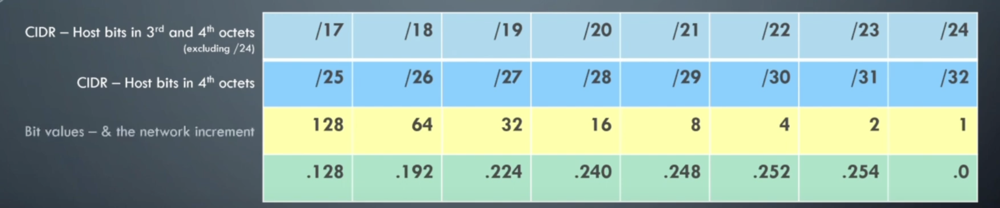

# NetPractice - Guide Complet

> [!IMPORTANT]
> Certaines explications présentes dans ce document proviennent de différentes sources \
> dont une vidéo particulièrement claire et utile que je recommande vivement \
> Lien vers la vidéo https://youtu.be/HQUw0CfQWAM?feature=shared

## 📋 Objectif du Projet

NetPractice est un exercice pratique qui vous permet de configurer de petits réseaux et de résoudre des problèmes de connectivité. Vous devrez comprendre et appliquer les concepts de :
- Adressage IP et sous-réseaux
- Routage et tables de routage
- Configuration réseau

## 🎯 Compétences Développées

- Configuration d'adresses IP et masques de sous-réseau
- Compréhension du routage réseau
- Résolution de conflits d'adressage
- Analyse de topologies réseau

## 📊 Architecture Réseau Type



*Diagramme représentant une topologie réseau typique du projet*

## 🔧 Concepts Essentiels

### 1. Définitions de Base

**LAN (Local Area Network) :** Réseau local où plusieurs appareils communiquent dans une zone limitée (ex: réseau domestique).

**Switch :** Appareil qui connecte plusieurs dispositifs dans un LAN et gère l'envoi des données entre eux.

**Router :** Dispositif qui connecte le LAN à des réseaux externes (Internet). Il peut avoir plusieurs adresses IP pour différents réseaux.

**Gateway :** Point d'entrée/sortie d'un réseau. Souvent le même appareil que le routeur mais avec une fonction différente.

### 2. Adressage IP

**Format IPv4 :** `XXX.XXX.XXX.XXX/XX`

```
Exemple : 192.168.1.10/24
├─ Adresse IP : 192.168.1.10
└─ Masque : /24 (255.255.255.0)
```

### 2. Masques de Sous-réseau (CIDR)

| CIDR | Masque          | Hôtes | Utilisation |
|------|-----------------|-------|-------------|
| /24  | 255.255.255.0   | 254   | Réseau standard |
| /25  | 255.255.255.128 | 126   | Division en 2 |
| /26  | 255.255.255.192 | 62    | Division en 4 |
| /27  | 255.255.255.224 | 30    | Division en 8 |
| /28  | 255.255.255.240 | 14    | Petit réseau |
| /30  | 255.255.255.252 | 2     | Liaison point-à-point |

### 3. Calcul de Sous-réseau

**Méthode rapide :**
1. **Incrément = 256 - dernier octet du masque**
2. **Multiplier par le numéro de sous-réseau**

**Exemple avec /26 :**
- Masque : 255.255.255.192
- Incrément : 256 - 192 = 64
- Sous-réseaux : 0, 64, 128, 192

### 4. Adresses Réservées

**Important :** Dans chaque réseau, 2 adresses sont réservées :
- **Adresse réseau** : Première IP (ex: 192.168.1.0)
- **Adresse broadcast** : Dernière IP (ex: 192.168.1.255)
- **Plage utilisable** : De .1 à .254 dans l'exemple ci-dessus

## 🛠️ Méthodologie de Résolution

### Stratégie "Clean Slate"
1. **Effacer tout** : Supprimez toutes les configurations dans les zones non grisées
2. **Repartir à zéro** : Commencez avec une vue propre
3. **Travailler à rebours** : Utilisez les valeurs par défaut données pour remplir le reste
4. **Un objectif à la fois** : Si plusieurs goals, les traiter séparément
5. **Vérifier fréquemment** : Tester après chaque modification

### Étape 1 : Analyser la Topologie
1. Identifier tous les appareils (PC, routeurs, switches)
2. Noter les connexions existantes
3. Repérer les adresses IP déjà configurées

### Étape 2 : Planifier l'Adressage
1. Déterminer les réseaux nécessaires
2. Choisir les masques appropriés
3. Éviter les conflits d'adresses

### Étape 3 : Configuration
1. Configurer les interfaces réseau
2. Définir les routes statiques
3. Tester la connectivité

## 📝 Règles de Configuration

### ✅ Bonnes Pratiques
- Utiliser des adresses cohérentes dans chaque sous-réseau
- Configurer les routes par défaut vers les gateways
- Respecter les plages d'adresses privées :
  - `10.0.0.0/8`
  - `172.16.0.0/12`
  - `192.168.0.0/16`

### ❌ Erreurs Courantes
- Adresses IP en conflit
- Masques de sous-réseau incorrects
- Routes manquantes ou incorrectes
- Utilisation d'adresses réseau ou broadcast

## 📊 Tableau de Référence CIDR

### Tableau Simplifié pour NetPractice

| CIDR | Masque (4e octet) | Incrément | Réseaux | Hôtes/réseau |
|------|-------------------|-----------|---------|---------------|
| /25  | 128               | 128       | 2       | 126          |
| /26  | 192               | 64        | 4       | 62           |
| /27  | 224               | 32        | 8       | 30           |
| /28  | 240               | 16        | 16      | 14           |
| /29  | 248               | 8         | 32      | 6            |
| /30  | 252               | 4         | 64      | 2            |

**Usage :** L'incrément vous donne directement les plages de sous-réseaux.

## 🔍 Exemples de Configuration

### Configuration Interface
```
Interface A1:
├─ IP : 192.168.1.1
└─ Masque : 255.255.255.0 (/24)
```

### Table de Routage
```
Destination     | Masque          | Next Hop (Gateway)
0.0.0.0         | 0.0.0.0         | 192.168.1.254
192.168.2.0     | 255.255.255.0   | 10.0.0.1
```

**Note :** "default" dans destination = route par défaut (0.0.0.0/0)

## 📚 Ressources Utiles

### Calculateurs Réseau
- Calcul de sous-réseaux en ligne
- Convertisseurs CIDR
- Outils de validation d'adresses IP

### Documentation
- RFC 791 (Internet Protocol)
- RFC 950 (Internet Standard Subnetting Procedure)
- Guide de routage TCP/IP

## 🎯 Stratégie de Réussite

### Approche Méthodique
1. **"Clean Slate"** : Effacez tout et repartez proprement
2. **Travailler à rebours** : Utilisez les valeurs données comme point de départ
3. **Un goal à la fois** : Ne pas se disperser sur plusieurs objectifs
4. **Vérifications fréquentes** : Tester après chaque modification
5. **Utiliser le tableau CIDR** : Référence rapide pour les calculs

### Conseils Pratiques
- **Même masque = même réseau** : Tous les appareils d'un réseau doivent avoir le même masque
- **Next Hop** : Dans les tables de routage, c'est l'adresse du prochain routeur
- **Point-to-point** : Utilisez /30 pour les liaisons entre routeurs
- **Plages privées** : Respectez 10.x.x.x, 172.16-31.x.x, 192.168.x.x

## 🔧 Outils de Débogage

### Problèmes Fréquents
- **Pas de connectivité** → Vérifier les adresses et masques
- **Routage impossible** → Contrôler les tables de routage
- **Conflits d'adresses** → Revoir l'attribution des IP

### Solutions Types
1. Recalculer les plages de sous-réseaux
2. Vérifier la cohérence des masques
3. S'assurer que les routes couvrent tous les réseaux

---

**💡 Conseil Final :** NetPractice est un exercice de logique réseau. Prenez le temps de comprendre chaque concept avant de passer au suivant. La maîtrise des bases vous permettra de résoudre efficacement tous les niveaux.

> [!TIP]
> Si ce contenu vous a été utile... \
> N'hésitez pas à laisser une ⭐️ étoile sur ce repo pour me soutenir !
